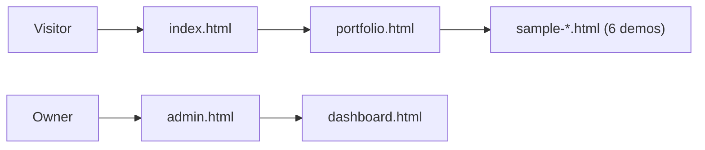

[← Back to README](./README.md)

# 404 Studio: Case Study

## Overview
- **What it is:** A multi-page website for 404 Studio, with a public portfolio, six live sample builds, and a dashboard/admin area.
- **Audience:** [Prospective clients / the studio owner]
- **My role & timeline:** [Solo? Dates?] (54 commits on `main`)

## Tech Stack
| Layer | Choice | Why |
|---|---|---|
| Markup / UI | Plain HTML pages (no framework build step) | Fast to ship, zero tooling, easy to host anywhere |
| Styling & scripts | [CSS / JS / libraries: fill in] | [reason] |
| Data / backend | [e.g. Supabase, Firebase, none] | [reason] |
| Hosting | [GitHub Pages / Netlify / Vercel] | [reason] |
| SEO | `robots.txt` + `sitemap.xml` | Crawlability from day one |

## Site Architecture

## API Architecture
> [Fill in: where does `dashboard.html` / `admin.html` get their data?]
- **Data source:** [REST API / Supabase / Firebase / localStorage]
- **Auth:** [how admin is protected]
- **Key calls:** [list endpoints or queries]
- **Error handling & security:** [validation, keys kept out of client code, etc.]

## Design Decisions
### 1. Static multi-page HTML over a framework
- **Alternatives:** React/Next.js, a CMS
- **Why:** [simplicity, speed, no build step]
- **Trade-off:** Shared header/footer is duplicated across pages

### 2. Sample sites as standalone pages
- **Why:** Each demo (e.g. Lumière + Lumière CRM) shows a different industry style and can be shared by its own URL
- **Trade-off:** More files to maintain

### 3. Separate dashboard and admin views
- **Why:** [role separation]
- **Trade-off:** [auth complexity]

## Challenges & Lessons Learned
- [Challenge → how you solved it]

## Results & Next Steps
- [Metrics, client feedback]
- **Next:** [shared header/footer partials, build step, analytics, etc.]

---
[← Back to README](./README.md)
